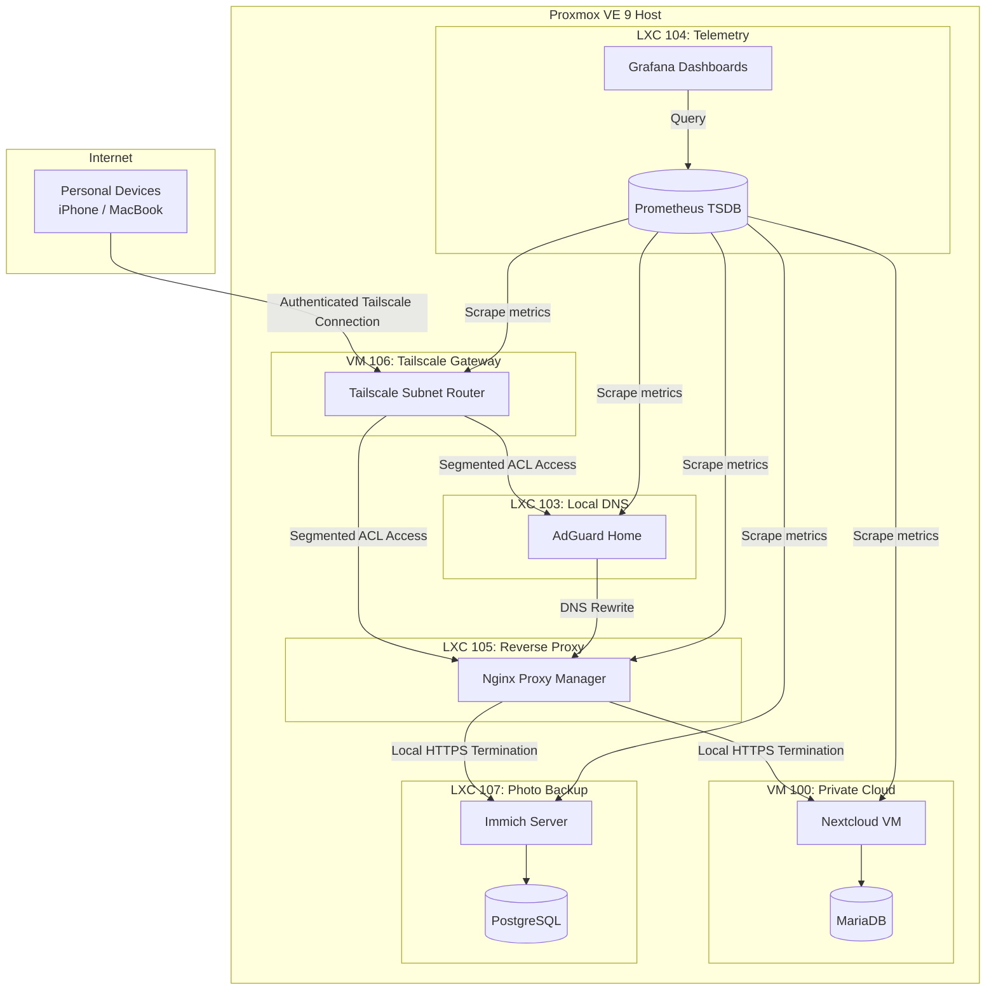

# 🏠 Secure Self-Hosted Infrastructure with Zero Trust Principles

This repository contains the Infrastructure as Code (IaC) configuration and system documentation for my self-hosted home laboratory running on **Proxmox VE 9**.

The infrastructure follows Zero Trust principles by applying identity-based access control, least privilege networking, and service isolation, paired with centralized telemetry.

---

## 📊 Live Monitoring Dashboard

*Real-time hardware and resource monitoring of the Proxmox host.*

---

## 🗺️ Network & Architecture Diagram

---

## 🛠️ Technology Stack

### Virtualization
- **Hypervisor:** Proxmox VE 9
- **Virtual Machines:** KVM/QEMU (Debian 13 Trixie)
- **Containers:** Unprivileged LXC (Debian 13 Trixie based)

### Networking & Security
- **Mesh VPN:** Tailscale (WireGuard-based)
- **Network Segmentation:** Tailscale ACL-based access control
- **Routing:** Linux IP forwarding & NAT (masquerading inside VM 104)

### Applications
- **Private Cloud:** Nextcloud Hub (TurnKey Linux appliance)
- **Immich:** Self-hosted photo and video backup (Dockerized inside LXC 107)
- **Database:** MariaDB (MySQL), PostgreSQL (Immich)
- **In-Memory Cache:** Redis (Nextcloud transactional file locking & Immich session cache)

### Edge, DNS & TLS
- **Reverse Proxy:** Nginx Proxy Manager (Dockerized inside LXC 105)
- **DNS-01 Challenge:** Let's Encrypt certificates managed via Cloudflare API
- **Local DNS & Filtering:** AdGuard Home (DNS filtering, local rewrites, encrypted upstream resolvers)

### Observability
- **Telemetry Collector:** Prometheus Node Exporter (installed on Proxmox host)
- **Time Series DB:** Prometheus TSDB (LXC 106)
- **Visualization:** Grafana (Dashboard ID 1860)

---

## 🔒 Security & Architecture Highlights

1. **No Inbound Ports Exposed:** No ports are forwarded on the home router. External access to private services is provided through authenticated Tailscale VPN tunnels.
2. **Device-Level Least Privilege (ACLs):** Even though devices are logged into the same Tailscale account, access is restricted by unique cryptographic device identities:
   - **MacBook (Admin):** Full network access (`*:*`).
   - **other Devices (Users):** Restricted strictly to Nextcloud (ports 80/443) and AdGuard DNS (port 53). All other local services are completely blocked.
3. **Local HTTPS with Let's Encrypt (DNS-01):** Valid SSL certificates are provisioned locally without opening ports 80/443 on the router, using the Cloudflare API to prove domain ownership.
4. **Gateway Isolation:** The VPN gateway runs in a dedicated KVM Virtual Machine instead of an unprivileged LXC container to natively handle Linux IP masquerading (NAT) and preserve host-level kernel integrity.

---

## 🖥️ Hardware Specification

- **Host:** Lenovo ThinkCentre M73 Mini PC
- **CPU:** Intel Core i5
- **RAM:** 12 GB
- **Storage:** 240 GB Crucial BX500 SSD (LVM-Thin with monitored allocation)

---

## 🔐 Operational Security & Maintenance

- **Automated Backups:** Scheduled virtual machine and container backups via Proxmox `vzdump` (Snapshot mode to avoid downtime) saved to local storage.
- **Regular Updates:** Manual package audits and system updates (`apt update && apt upgrade`) executed inside isolated containers and virtual machines.
- **Service Monitoring:** Real-time hardware telemetry and storage pool monitoring to prevent LVM-Thin overprovisioning saturation.