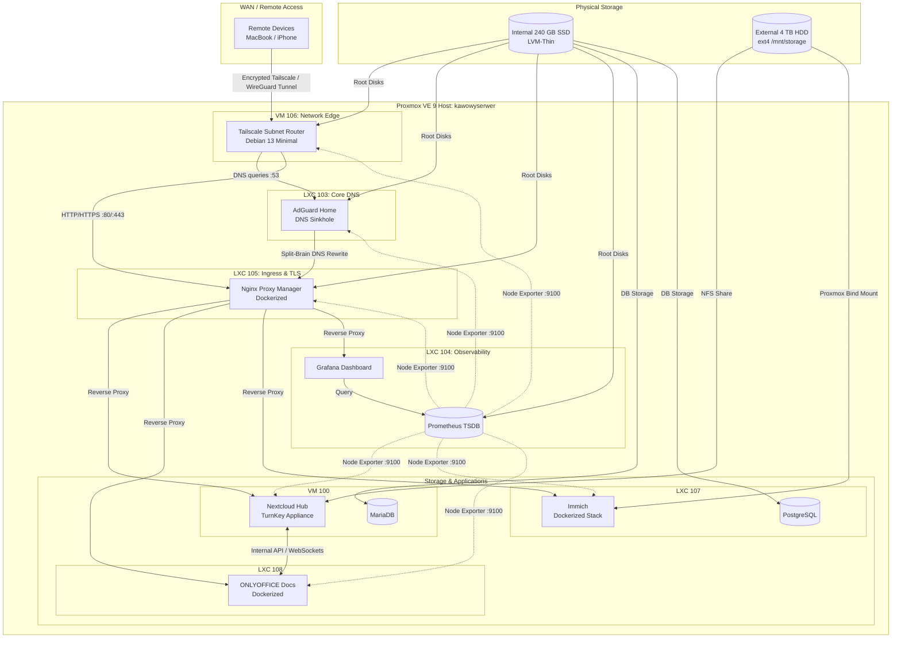

# Homelab Infrastructure

A self-hosted home laboratory built on a refurbished mini PC running **Proxmox VE 9**.

This repository contains the infrastructure configuration, deployment manifests, network policies, and technical documentation behind the project.

The goal is to build a private, maintainable infrastructure for self-hosted services while learning and documenting Linux, virtualization, networking, security, and observability in practice.

> 📖 This project is documented as a step-by-step technical series on [Medium](https://medium.com/@weronika.z.kawa), detailing the architectural decisions, troubleshooting hurdles, and solutions behind each service.

---

## System Architecture



---

## Project Status

This is an active, ongoing homelab environment.

### Completed
- [x] Bare-metal hypervisor installation (Proxmox VE 9)
- [x] Remote mesh networking & subnet routing (Tailscale on dedicated VM)
- [x] Device-level Zero Trust access control (Tailscale ACLs)
- [x] Local DNS resolution and network-wide ad-blocking (AdGuard Home)
- [x] Local SSL termination via Cloudflare DNS-01 API (Nginx Proxy Manager)
- [x] Private cloud storage deployment & data migration (Nextcloud Hub)
- [x] Collaborative online document editing (ONLYOFFICE Docs)
- [x] Self-hosted photo and video backup (Immich)
- [x] Infrastructure telemetry and dashboarding (Prometheus & Grafana)

### Planned
- [ ] Implement an automated backup and disaster recovery strategy with offsite replication.
- [ ] Automate VM/LXC provisioning and configuration with Terraform and Ansible to enable full, reproducible rebuilds.
- [ ] Deploy centralized authentication (SSO) with enforced multi-factor authentication (MFA) across web services.
- [ ] Set up Uptime Kuma for service availability monitoring alongside Prometheus Alertmanager for push notifications on system events.
- [ ] Deploy a unified start page (e.g., Homepage) to aggregate service shortcuts and real-time status widgets.

---

## 📑 Documentation Index

Detailed technical specifications, step-by-step deployment notes, and runbooks are organized in the [`docs/`](docs/) directory:

| Document | Service | Type | Primary Role |
| :--- | :--- | :--- | :--- |
| [`01-proxmox.md`](docs/01-proxmox.md) | **Proxmox VE 9** | Host / Bare-metal | Hypervisor setup, storage layout, LVM-Thin overprovisioning |
| [`02-tailscale.md`](docs/02-tailscale.md) | **Tailscale Gateway** | KVM VM (`106`) | Subnet routing (`192.168.0.0/24`), device-level ACL firewall |
| [`03-adguard-home.md`](docs/03-adguard-home.md) | **AdGuard Home** | LXC Container (`103`) | Network-wide DNS sinkhole, DoH/DoT upstream, DNS rewrites |
| [`04-nginx-proxy-manager.md`](docs/04-nginx-proxy-manager.md) | **Nginx Proxy Manager** | LXC Container (`105`) | Reverse proxy, Let's Encrypt Wildcard SSL via Cloudflare DNS-01 |
| [`05-nextcloud.md`](docs/05-nextcloud.md) | **Nextcloud Hub** | KVM VM (`100`) | Private cloud, NFS client mount, Apache reverse-proxy tuning |
| [`06-onlyoffice.md`](docs/06-onlyoffice.md) | **ONLYOFFICE Docs** | LXC Container (`108`) | Real-time collaborative document server, JWT authentication |
| [`07-immich.md`](docs/07-immich.md) | **Immich** | LXC Container (`107`) | Photo/video backup, Docker Compose, Proxmox bind-mount storage |
| [`08-monitoring.md`](docs/08-monitoring.md) | **Prometheus & Grafana**| LXC Container (`104`) | Node Exporter host telemetry, time-series metrics, Dashboard 1860 |

---

## 🖥️ Hardware Specifications

| Component | Specification | Details |
| :--- | :--- | :--- |
| **System** | Lenovo ThinkCentre M73 Tiny | Ultra-small form factor (USFF) |
| **Processor** | Intel Core i5-4570T | 2 Cores, 4 Threads @ 2.90 GHz (Boost up to 3.60 GHz) |
| **Memory** | 12 GB DDR3 SODIMM | 4 GB base + 8 GB extension module |
| **System Storage** | 240 GB Crucial BX500 SSD | Internal 2.5" SATA III (`/dev/sda`), LVM-Thin |
| **Mass Storage** | 4 TB Seagate Basic HDD | External 2.5" USB 3.0 (`/dev/sdb`), formatted as `ext4` |
| **Network** | Intel I217-LM Gigabit Ethernet | Wired RJ-45 connection (`enp0s25`), no Wi-Fi interface |

---

## 📂 Repository Layout

```text
homelab-infrastructure/
├── README.md                 # Project overview, architecture map, documentation index
├── LICENSE                   # MIT License
├── .gitignore                # System, secret, and volume ignore patterns
├── docs/                     # Technical documentation for individual services
│   ├── 01-proxmox.md
│   ├── 02-tailscale.md
│   ├── 03-adguard-home.md
│   ├── 04-nginx-proxy-manager.md
│   ├── 05-nextcloud.md
│   ├── 06-onlyoffice.md
│   ├── 07-immich.md
│   └── 08-monitoring.md
├── network/                  # Network policies and local resolution tables
│   ├── tailscale-acl.json    # Sanitized device-level ACL firewall configuration
│   └── dns-rewrites.txt      # Local split-brain DNS rewrite mappings
└── services/                 # Service deployment manifests and configurations
    ├── nginx-proxy-manager/
    │   └── docker-compose.yml
    ├── nextcloud/
    │   ├── config.php
    │   └── nextcloud.conf
    ├── onlyoffice/
    │   └── docker-compose.yml
    ├── immich/
    │   ├── docker-compose.yml
    │   └── env-template.env
    └── monitoring/
        └── prometheus.yml
```

---

## Architectural Decisions

- The perimeter router forwards no inbound ports. All remote access routes through Tailscale.
- Tailscale ACLs limit non-admin devices to ports 80/443 on the reverse proxy and port 53 on AdGuard Home. Access to the Proxmox interface (port 8006), SSH (port 22), and direct backend IPs is restricted to the administrator machine.
- TLS certificates are issued via Cloudflare DNS-01 challenges, terminating HTTPS locally without requiring open HTTP verification ports.
- Container filesystems and databases (PostgreSQL, MariaDB) reside on the internal SSD. Nextcloud data and Immich media mount from the external 4 TB HDD using NFS and Proxmox bind mounts.
